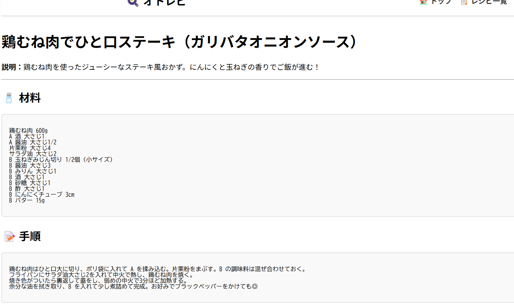

# 🍳 オトレピ - レシピ読み上げアプリ


---

## 📖 概要

このアプリは、料理中に手がふさがっていてもスマホを操作せずにレシピを確認できる「読み上げ対応レシピアプリ」です。

ユーザーは自分でレシピを登録し、音声でステップごとの手順を読み上げてもらうことができます。  
**「見る」から「聴く」へ。料理体験をもっとスムーズに！**

---

## ✨ 機能（MVP）

- レシピの登録（タイトル・材料・手順）
  
- 登録済みレシピの一覧表示
  
- 登録済みレシピの詳細表示
  
- ステップごとに音声でレシピを読み上げる（ブラウザの音声合成機能を使用）
  

---

## 🛠 使用技術

- **フレームワーク**：Ruby on Rails
- **言語**：Ruby / HTML / CSS / JavaScript
- **データベース**：SQLite（開発環境）
- **音声読み上げ**：`SpeechSynthesis API`（ブラウザ組み込み）

---

## ⚙️ セットアップ方法（開発環境）

```bash
git clone https://github.com/tomotomotom/otorepi.git
cd otorepi
bundle install
rails db:create db:migrate
rails server
```

## 🗂 データベース設計

### 🥘 recipes テーブル（レシピ本体）

| カラム名       | 型       | 説明                                       |
|----------------|----------|--------------------------------------------|
| id             | integer  | 主キー                                     |
| title          | string   | レシピタイトル                             |
| description    | text     | レシピの補足説明（任意）                   |
| materials_text | text     | 材料をまとめて記述（複数行テキスト）       |
| steps_text     | text     | 手順をまとめて記述（複数行テキスト）       |
| created_at     | datetime | 作成日時                                   |
| updated_at     | datetime | 更新日時                                   |

---

## 🔮 今後の予定（発展機能）

Amazon Polly等を使った高品質音声読み上げ

レシピのお気に入り機能

レシピの共有（他ユーザーと使える機能）

ユーザー登録・ログイン機能（任意）

---

## ⏰ 制作時間
約3週間（企画〜デプロイまで）

---

## 📄 ライセンス
MIT License

